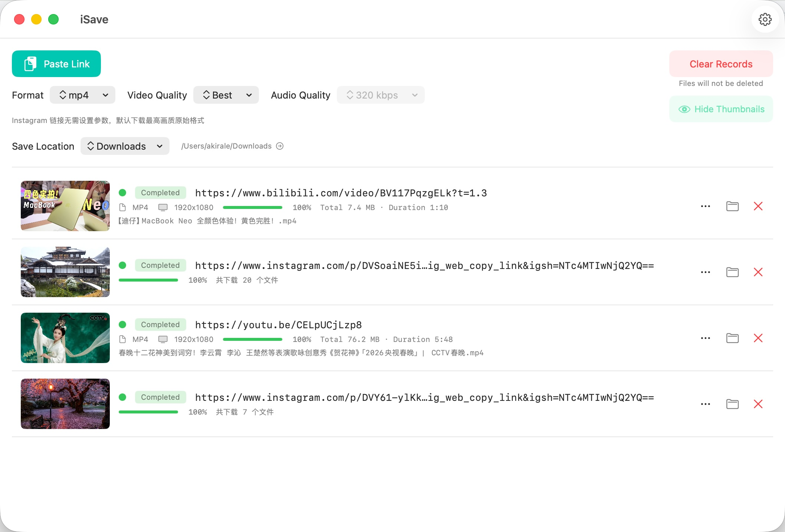

# iSave

**English** | [中文](README.zh.md)

A macOS video downloader that supports YouTube, Instagram, TikTok, and 1000+ other sites.

Powered by [yt-dlp](https://github.com/yt-dlp/yt-dlp), [ffmpeg](https://ffmpeg.org/), and [gallery-dl](https://github.com/mikf/gallery-dl) — bundled and ready to use out of the box.



---

## Features

- **Multi-platform**: YouTube, Instagram, TikTok, Bilibili, and 1000+ sites supported by yt-dlp
- **Flexible formats**: Export as MP4, MKV, MP3, or M4A
- **Quality options**: Choose video resolution and audio bitrate
- **Concurrent downloads**: Set 1 / 2 / 3 / 5 simultaneous tasks
- **Cookie support**: Automatically reads cookies from Safari, Chrome, etc. for login-required content
- **Sleep prevention**: Keeps the system awake during downloads
- **Auto update check**: Built-in version checker

## Requirements

- macOS 12.4 or later
- Apple Silicon or Intel

## Download

Visit the [Releases](https://github.com/akiralereal/iSave/releases) page to download the latest `.dmg`.

## Build from Source

```bash
git clone https://github.com/akiralereal/iSave.git
cd iSave
open iSave.xcodeproj
```

In Xcode:
1. **Signing & Capabilities** → select your own Apple Developer account
2. **Product → Run** (⌘R)

> Xcode will automatically resolve SPM dependencies on first build.

## Updating Bundled Tools

### yt-dlp

```bash
curl -L https://github.com/yt-dlp/yt-dlp/releases/latest/download/yt-dlp_macos -o iSave/yt-dlp
chmod +x iSave/yt-dlp
```

### gallery-dl

```bash
curl -L https://github.com/mikf/gallery-dl/releases/latest/download/gallery-dl.bin -o iSave/gallery-dl
chmod +x iSave/gallery-dl
```

## Contributing

Issues and Pull Requests are welcome.

## License

[MIT License](LICENSE)
