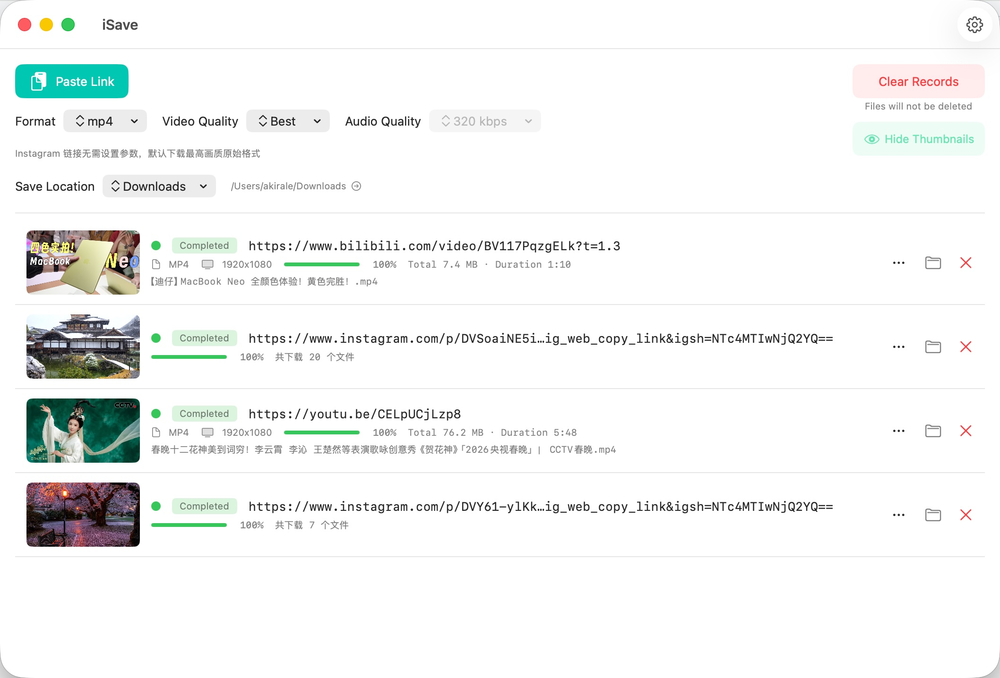

# iSave

**English** | [中文](README.zh.md)

<strong>Want more updates? Visit iFans Club:</strong>

<a href="https://ifansclub.com/"><code>https://ifansclub.com/</code></a>

A macOS video & picture downloader that supports YouTube, Instagram, TikTok, and 1000+ other sites.

Powered by [yt-dlp](https://github.com/yt-dlp/yt-dlp), [ffmpeg](https://ffmpeg.org/), and [gallery-dl](https://github.com/mikf/gallery-dl) — bundled and ready to use out of the box.

---

## Features

- **Multi-platform**: YouTube, Instagram, TikTok, Bilibili, and 1000+ sites supported by yt-dlp
- **Flexible formats**: Export as MP4, MKV, MP3, or M4A
- **Quality options**: Choose video resolution and audio bitrate
- **Concurrent downloads**: Set 1 / 2 / 3 / 5 simultaneous tasks
- **Cookie support**: Automatically reads cookies from Safari, Chrome, etc. for login-required content
- **Sleep prevention**: Keeps the system awake during downloads
- **Auto update check**: Built-in version checker

## Requirements

- macOS 12.4 or later
- Apple Silicon (M1 or later)

## Download

Visit the [Releases](https://github.com/akiralereal/iSave/releases) page to download the latest `.dmg`.

## ☕ Sponsor / Buy Me a Coffee

> If this project helps you, consider supporting it :)

<table>
  <tr>
    <td align="center"><b>❤️ GitHub Sponsors</b></td>
    <td align="center"><b>☕ Ko-fi</b></td>
    <td align="center"><b>💰 USDT (TRC20)</b></td>
  </tr>
  <tr>
    <td align="center">
      
    </td>
    <td align="center">
      
    </td>
    <td align="center">
       
      <code>TArpwDgewYSFCYX6XoJ6drwpEU6UGBw5yq</code>  
      ⚠️ Only via <b>TRON (TRC20)</b> network — do not use any other network
    </td>
  </tr>
</table>

## Contributing

Issues and Pull Requests are welcome.

## License

[GPL v3](LICENSE)
