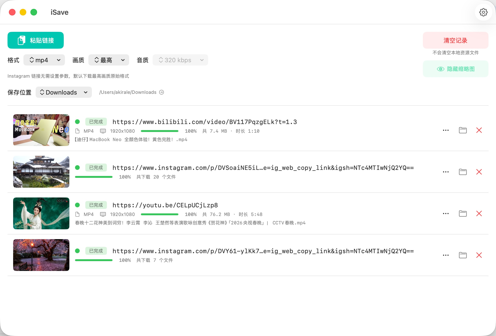

# iSave

[English](README.md) | **中文**

<h3 align="center"><a href="https://ifansclub.com/">如果你想关注更多，可以访问 https://ifansclub.com/</a></h3>

一款 macOS 视频下载工具，支持 YouTube、Instagram、TikTok、哔哩哔哩等 1000+ 平台。

内置 [yt-dlp](https://github.com/yt-dlp/yt-dlp)、[ffmpeg](https://ffmpeg.org/)、[gallery-dl](https://github.com/mikf/gallery-dl)，开箱即用，无需额外安装。



---

## 功能

- **多平台支持**：YouTube、Instagram、TikTok、哔哩哔哩及 yt-dlp 支持的 1000+ 网站
- **格式灵活**：导出 MP4、MKV、MP3、M4A
- **画质可选**：支持选择视频分辨率和音频码率
- **并发下载**：可设置同时下载任务数（1 / 2 / 3 / 5）
- **Cookie 支持**：自动读取 Safari、Chrome 等浏览器 Cookie，下载需登录内容
- **防睡眠**：下载期间可保持系统唤醒
- **自动更新检测**：内置版本检查

## 系统要求

- macOS 12.4 或更高版本
- Apple Silicon 或 Intel

## 下载

前往 [Releases](https://github.com/akiralereal/iSave/releases) 页面下载最新版本 `.dmg` 文件。

## 从源码构建

```bash
git clone https://github.com/akiralereal/iSave.git
cd iSave
open iSave.xcodeproj
```

在 Xcode 中：
1. **Signing & Capabilities** → 选择你自己的 Apple Developer 账号
2. **Product → Run**（⌘R）

> 首次构建 Xcode 会自动拉取 SPM 依赖，无需手动操作。

## 更新内置工具

### yt-dlp

```bash
curl -L https://github.com/yt-dlp/yt-dlp/releases/latest/download/yt-dlp_macos -o iSave/yt-dlp
chmod +x iSave/yt-dlp
```

### gallery-dl

```bash
curl -L https://github.com/mikf/gallery-dl/releases/latest/download/gallery-dl.bin -o iSave/gallery-dl
chmod +x iSave/gallery-dl
```

## 参与贡献

欢迎提交 Issue 和 Pull Request。

## 开源许可

[GPL v3](LICENSE)
