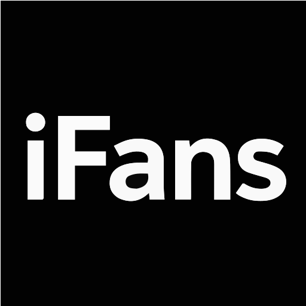
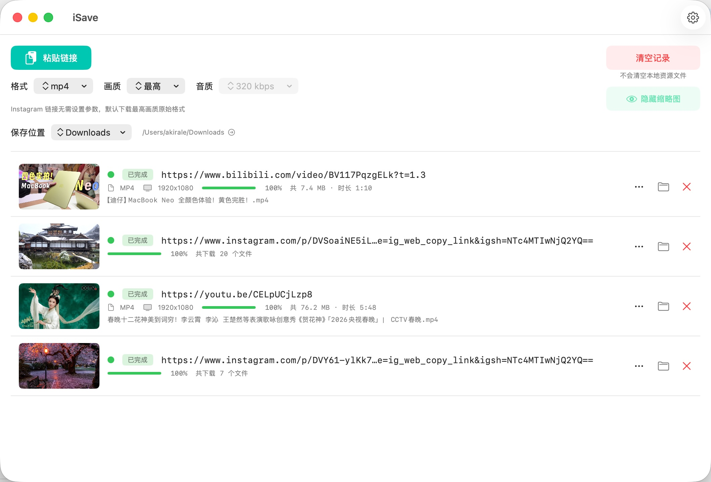

# iSave

[English](README.md) | **中文**

<strong>如果你想关注更多，可以访问 iFans Club：</strong>

<a href="https://ifansclub.com/"><code>https://ifansclub.com/</code></a>

一款 macOS 视频和图片下载工具，支持 YouTube、Instagram、TikTok、哔哩哔哩等 1000+ 平台。

内置 [yt-dlp](https://github.com/yt-dlp/yt-dlp)、[ffmpeg](https://ffmpeg.org/)、[gallery-dl](https://github.com/mikf/gallery-dl)，开箱即用，无需额外安装。

---

## ☕ 打赏支持 / Buy Me a Coffee

> 如果这个项目对你有帮助，欢迎支持一下 :)

<table>
  <tr>
    <td align="center"><b>❤️ GitHub Sponsors</b></td>
    <td align="center"><b>☕ Ko-fi</b></td>
    <td align="center"><b>💰 USDT (TRC20)</b></td>
  </tr>
  <tr>
    <td align="center">
      
    </td>
    <td align="center">
      
    </td>
    <td align="center">
       
      <code>TArpwDgewYSFCYX6XoJ6drwpEU6UGBw5yq</code>  
      ⚠️ 仅支持 <b>TRON (TRC20)</b> 网络，请勿使用其他网络 Only via <b>TRON (TRC20)</b> network
    </td>
  </tr>
</table>

---

## 功能

- **多平台支持**：YouTube、Instagram、TikTok、哔哩哔哩及 yt-dlp 支持的 1000+ 网站
- **格式灵活**：导出 MP4、MKV、MP3、M4A
- **画质可选**：支持选择视频分辨率和音频码率
- **并发下载**：可设置同时下载任务数（1 / 2 / 3 / 5）
- **Cookie 支持**：自动读取 Safari、Chrome 等浏览器 Cookie，下载需登录内容
- **防睡眠**：下载期间可保持系统唤醒
- **自动更新检测**：内置版本检查

## 系统要求

- macOS 12.4 或更高版本
- Apple Silicon（M1 及以上）

## 下载

前往 [Releases](https://github.com/akiralereal/iSave/releases) 页面下载最新版本 `.dmg` 文件。

## 参与贡献

欢迎提交 Issue 和 Pull Request。

## 开源许可

[GPL v3](LICENSE)
